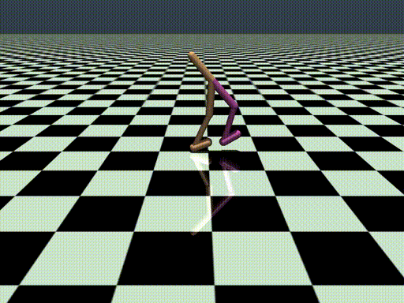
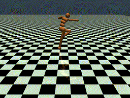

# sieknet
## A dependency-free recurrent neural network library written in C
This is a recurrent neural network and deep learning library written in C which implements various machine learning algorithms. I have mostly focused on recurrent and memory-based networks while writing this, because these interest me the most.

This project has no mandatory dependencies and is written completely from scratch - all you need to compile and run this code is `gcc` or any C compiler.


##### Contents  
 - [But why?](#purpose)  

 - [Samples](#samples)

 - [Quick Start](#quickstart)

   - [Unsupervised Learning](#ul)

   - [Reinforcement Learning](#rl)

 - [Features](#features)  

 - [Future Plans](#future)  

 - [GPU Acceleration](#gpu)

 - [General Usage](#usage)

    - [Architectures](#archs)

      - [Multilayer Perceptrons](#mlp)

      - [Recurrent Neural Networks](#rnn)

      - [Long Short-Term Memory](#lstm)

    - [Algorithms](#algos)

      - [State normalization](#sn)

      - [Augmented Random Search](#ars)

      - [Neuroevolution](#ga)


<a name="purpose">

## But why?

This project began in June of 2018, when I decided to teach myself how neural networks work while working a summer internship. I decided to implement the algorithms I was learning about in the language I was most comfortable in - C. At some point that summer, I stumbled across Andrej Karpathy's [inspirational article](http://karpathy.github.io/2015/05/21/rnn-effectiveness/) on RNNs, and was struck by how powerful these relatively simple algorithms were at capturing highly complex relationships across time, and began trying to understand how to implement these algorithms from scratch. This project has essentially been one giant learning experience as I have slowly built up my knowledge of the underlying math and statistic involved in deep learning. It is not an attempt to create a full-featured library, though I have tried to make it as useful as possible. It was my goal to create an easy-to-use, fast, efficient and clean implementation of the algorithms involved in training and using recurrent neural networks.

That said, this library is unlikely to be more useful to you than any existing architecture; if you're a researcher, you're probably already using a Python-based framework like PyTorch, TensorFlow, or Caffe. If you're trying to bring neural networks to an embedded systems platform, or you're trying to accelerate your experiments by using a compiled language, you can find some wonderful C-based libraries available online, from the minimalist [Genann](https://github.com/codeplea/genann) to the relatively full-featured [FANN](https://github.com/libfann/fann). I have additionally decided to focus only on implementing recurrent architectures - it is unlikely that convolution, for instance, will be implemented.

If you would like to use my library, you can find instructions on use below, as well as a description of the general architecture.

<a name="samples">

## Samples			

Here are a few policies trained on various OpenAI-Gym environments using Augmented Random Search:

<p float="left">
  
  
  
  

</p>

Here is a short sample from an lstm trained on shakespeare's complete works:

    PRINCE. My lord, now, then him in the with thee,
      For speak to the with the part of the wide,
      And with the with a straing to the with the wears and the
      sweet the with the with thee truity, and like the mack
      this the with
      two in betwee the with the discoure did the words
      Thou are not the with with that the with the wit
      sating to prison?
    FALSTAFF. You are the with him the with the body
      make in the with the?
      He will you after thou doth my like and the wite;
      You are let the will become poor and like a such of
      the with the with this with him the will be him
      turn the with the with that the well!
    HOSTESS. No lustion to the within their king of endurs
      the with the wise the
      the with his a bount of themself-
      good true thee did the witch good-ly the within to the was a comfuls
      to the within the with eyes and the withins and
      the will appears, as the wide to himself

Here is a short sample from an lstm trained on the bible:

    13:24 The righteous is a fool is an hand to the soul of the mouth of his ways; and he goeth for her hands.
    11:2 The wealth of the wicked shall be as a fool is an honey intreated.
    11:20 The soul of the words of the way was there.
    12:2 The man that it is of a fool is a fool's son, and as a fool is for the way of glach.
    11:2 The wicked maketh as a fool is made an hundred and good.

Here is a short sample from an lstm trained the complete works of Jane Austen:

    "I cannot be a brother introduced into the party, that
    it was not a point of the parter of the partyes. I am
    sure you are not if they not to be a pleasure of Kinding
    the past of conduct, which had been possible."

    "In you think it is for a perfections of the past of the world,
    and the difting interest of the first times read in, and I am
    sure you must till me to be so easy it is at any other and as
    I would not be a place of Bath and as it is at all to
    be as interesting the party one end of such a present--ill of
    the party of the party of the person, and these was only
    to be a propose of things offered active interesting the other
    attention. I am sure you as well on a perfection of the house of
    the party."


<a name="quickstart"/>

## Quick Start

I've written a bash script which you can use to easily compile and run sieknet.

You'll first need to clone the repo:
```
git clone https://github.com/siekmanj/sieknet
```

Then, cd into the cloned repo and give the bash script permission to run:
```
cd sieknet
chmod +x sieknet
```

You can also put the above in your .bashrc to make it permanent - that way you won't have to run it after every reboot or when you close your terminal window.

<a name="ul"/>

## Unsupervised Learning

### char-nn

You can use Sieknet to create your own char-nn (and generate text samples as shown above). You'll need to supply your own text file; I recommend the complete works of William Shakespeare, [available here](http://www.gutenberg.org/files/100/100-0.txt). To train a char-nn, simply type:

```
./sieknet char_nn --new ./where/to/save/the/model.lstm --train ./where/your/text_file/is.txt
```

If you have a GPU and you'd like to use it, you can use the `--gpu` option.

```
./sieknet char_nn --new ./where/to/save/the/model.lstm --train ./where/your/text_file/is.txt --gpu
```

Please note that using the GPU might actually be slower than using the CPU due to the overhead of transferring data across the PCI-E bus. It only makes sense to use the GPU when working with large models - so let's try doing that next.

```
./sieknet char_nn --new ./test.lstm --train ./data.txt --layers 5 --hidden_size 1024 --gpu
```

You'll notice that we used the `--layers 5` and `--hidden_size 1024` options. Of the five layers, one is a softmax output layer, and one is a 'pretend' input layer; only three of the five are actually recurrent layers. However, each of the recurrent layers is 1024 nodes large. In total, the above network has about 21,475,424 parameters; not especially large by research standards, but it should give your GPU a nice workout.

<a name="rl"/>

## Reinforcement Learning

Implemented are a few of the MuJoCo locomotion environments and a variety of reinforcement learning algorithms. You'll need [MuJoCo](http://www.mujoco.org/) to use them.

### random search

Augmented Random Search is an ingeniously simple black-box optimization algorithm developed by Benjamin Recht's group. It is very parallelizable and computationally efficient. My implementation supports multithreading through OpenMP (an optional dependency) and you will probably experience a large speedup by using the `--threads [n]` option.

```
./sieknet rs --train --new ./model/walker2d.mlp --env walker2d --directions 200 --std 0.0075 --lr 0.005 --timesteps 1e7 --threads 4
```

By default, the algorithm used is ARS-v1 (from the ARS paper), but you can specify which algorithm to use. The `use_top` option sets the proportion of top-performing directions to use. `--use_top 0.1` will consider only the top 10% of directions. Fair warning - I'm not confident I implemented the online state normalization right, so V2 and V2_t might not work as expected.

```
./sieknet rs --train --new ./model/humanoid.mlp --env humanoid --algo V1
./sieknet rs --train --new ./model/humanoid.mlp --env humanoid --algo V2
./sieknet rs --train --new ./model/humanoid.mlp --env humanoid --algo V1_t --use_top 0.5
./sieknet rs --train --new ./model/humanoid.mlp --env humanoid --algo V2_t --use_top 0.5
```

ARS will by default use a linear policy, but you can use any architecture implemented.

```
./sieknet rs --train --new ./model/cheetah.rnn --env half_cheetah --rnn
./sieknet rs --train --new ./model/cheetah.rnn --env half_cheetah --lstm
```

### genetic algorithms

You can use sieknet to train a pool of neural networks to come up with control and locomotion strategies in a variety of OpenAI gym-style environments using any of the implemented genetic algorithms. To train an MLP on the Hopper environment,
```
./sieknet ga --train --new ./model/hopper.mlp --env hopper --pool_size 1000 --std 1.0 --mutation_rate 0.05 --timesteps 1e6
```
You could experience between a potentially quite large speedup on a multicore machine by using the `--threads [n]` option.
```
./sieknet ga --train --new ./model/hopper.mlp --env walker2d --pool_size 1000 --hidden_size 64 --threads 8
```

Several genetic algorithms are implemented - including UberAI's safe mutations w/ gradients, momentum, and a variety of hybrids.
```
./sieknet ga --train --new ./model/hopper.mlp --env hopper --mutation_type SAFE
```

You can also just use a vanilla genetic algorithm.
```
./sieknet ga --train --new ./model/hopper.mlp --env hopper --mutation_type BASELINE --crossover
```

Recurrent networks are likewise implemented - to train an lstm, just use the `--lstm` flag. To train an rnn, use the `--rnn` flag.
```
./sieknet ga --train --new ./model/hopper.lstm --env hopper --mutation_type BASELINE --crossover --lstm
```

<a name="features"/>

## Features

Features include:
 - multiplayer perceptron (MLP)
 - vanilla recurrent neural network (RNN)
 - long short-term memory (LSTM)
 - stochastic gradient descent
 - stochastic gradient descent with momentum
 - neuroevolution
   - safe mutations w/ gradients [(UberAI)](https://arxiv.org/abs/1712.06563)
   - momentum (originally described [here](https://www.researchgate.net/publication/220935617_Accelerating_Real-Valued_Genetic_Algorithms_Using_Mutation-with-Momentum) by Temby et. al.
 - [augmented random search (ARS)](https://arxiv.org/abs/1803.07055)
 - OpenAI-gym-style MuJoCo environments
 - [backpropagation through time (BPTT)](https://en.wikipedia.org/wiki/Backpropagation_through_time)

 - GPU support (via OpenCL)
 - platform agnosticism
 - zero dependencies

<a name="future"/>

## Future

Plans for the near future include:
 - [ ] hopfield networks
 - [ ] boltzmann machines
 - [ ] neural turing machine
 - [ ] differentiable neural computer
 - [ ] novelty search
 - [ ] adam stochastic optimizer
 - [ ] gated recurrent unit (GRU)
 - [ ] policy gradients
    - [ ] PPO
    - [ ] DDPG
    - [ ] TD3

<a name="gpu">

## GPU Acceleration

As of April 2019, you can run sieknet on your GPU via OpenCL 1.1. If you don't need to use the GPU, you don't need to worry about installing OpenCL - it is an optional dependency.

If you would like to use the GPU, you need to `#define SIEKNET_USE_GPU` when compiling so that the correct headers are used. You can put this in include/conf.h, or declare it with the -D flag (check the Makefile for an example).


<a name="usage"/>

# General Usage

<a name="archs" />
## Architectures

All networks have a member array that stores the parameters of the network (`n.params`), and an array that stores the gradient of the loss function with respect to the parameters (`n.param_grad`).  

Every network architecture additionally has three basic functions: `{network_type}_forward`, `{network_type}_cost`, and `{network_type}_backward`. The forward pass is calculated by `{network_type}_forward` - the cost and gradient of the network's output are calculated by `{network_type}_cost`, and `{network_type}_backward` calculates the gradient of the loss function with respect to the parameters of the neural network. The `n.param_grad` array is calculated and updated by the networks' `{network_type}_backward` functions.

`n.params` and `n.param_grad` correspond to each other - i.e., the ith index of `n.param_grad` is the gradient of the ith index of `n.params`. This makes writing optimizers particularly straightforward and modular. So far, I have implemented two - stochastic gradient descent and sgd + momentum.

I've also made use of some macro magic to allow for constructors that can take an arbitrary number of layer sizes (very python-like). For instance, every call to the constructor below is valid and will compile:

```C
LSTM n = create_lstm(10, 5, 6, 1);
LSTM n = create_lstm(10, 10, 2);
LSTM n = create_lstm(1, 2, 3, 4, 5, 6, 7, 8);
```
Various demonstrations of how to use the library can be found in `/example/`, along with a makefile for compiling them.

<a name="optimizers">

### Optimizers

You can create an optimizer using the `create_optimizer` macro, which takes as arguments the type of optimizer and the network it is optimizing (passed by value).

```C
SGD o1 = create_optimizer(SGD, neural_network); //create a stochastic gradient descent optimizer.
Momentum o2 = create_optimizer(Momentum, neural_network); //create a momentum optimizer

o1.step(o1); //Perform a parameter update with sgd using n.param_grad.
o2.step(o2); //Perform a parameter update with momentum using n.param_grad.

```

<a name="mlp">

### Multilayer Perceptron
Create a 2-layer mlp with an input dimension of 784 neurons:
```C
MLP n = create_mlp(784, 50, 10);
```
Create a 3-layer network with an input dimension of 24 neurons:
```C
MLP n = create_mlp(24, 35, 25, 10);
```

Run a single forward/backward step, and update the parameters:
```C
MLP n = create_mlp(2, 16, 2); //Create a 2-layer network with hidden layer size 16.
SGD o = create_optimizer(SGD, n); //Create a stochastic gradient descent optimizer object.
o.learning_rate = 0.01;

float x[2] = {0.5, 0.1}; //network input
float y[2] = {0.0, 1.0}; //output label

mlp_forward(&n, x); //Run forward pass
float cost = mlp_cost(&n, y); //Evaluate cost of network output
mlp_backward(&n); //Run backward pass (calculate n.param_grad)

o.step(o); //Update the parameters of the network using gradients calculated in mlp_backward.

dealloc_mlp(&n); //Free the network's memory from the heap
```

You can also just run the forward pass:
```C
while(1){
	mlp_forward(&n, x);
	printf("network output: %d\n", n.guess);
}
```

By default, hidden layers will use the sigmoid logistic function and the output layer will use softmax. However, you can use any of the other activation functions implemented:
```C
MLP n = create_mlp(10, 50, 20, 35, 5);
n.layers[0].logistic = hypertan; //The layer of size 50 will now use tanh activation
n.layers[1].logistic = softmax; //The layer of size 20 will now use softmax activation
n.layers[2].logistic = relu; //The layer of size 35 will now use rectified linear unit activation
n.layers[3].logistic = sigmoid; //The output layer of size 5 will now use sigmoid activation
```

Save/load models to disk:
```C
save_mlp(&n, "../model/file.mlp");
dealloc_mlp(&n);
n = load_mlp("../model/file.mlp");
```

<a name="rnn">

### Recurrent Neural Networks
You can create an RNN just like an MLP. The first number provided will be the input dimension to the network, subsequent numbers will be the size of hidden layers, and the final number will be the size of the softmax output layer. You can have as many hidden layers as you'd like, just as with an MLP.

```C
RNN n = create_rnn(5, 10, 5); //Creates an rnn with input dim 5, hidden (recurrent) layer of size 10, softmax layer of 5.
```

Swapping logistic functions of any of the recurrent layers is done by setting the `.logistic` attribute. By default, recurrent layers will use tanh in hidden layers and softmax in the output layer.

```C
RNN n = create_rnn(10, 5, 2, 9);
n.layers[0].logistic = hypertan; //The layer of size 5 will now use tanh activation
n.layers[1].logistic = softmax; //The layer of size 2 will now use softmax activation
n.layers[3].logistic = sigmoid; //The output layer of size 9 will now use sigmoid activation
```

Using the forward, cost and backward functions is a little more complicated than with a normal MLP, but is still fairly straightforward.

```C
RNN n = create_rnn(2, 5, 2);
Momentum o = create_optimizer(Momentum, n); //Create a momentum optimizer
o.alpha = 0.01;
o.beta = 0.99;

n.seq_len = 3;  //How long the time sequences in your data are.
n.stateful = 0; //Reset hidden state & cell state every parameter update.
for(int i = 0; i < 6; i++){
	rnn_forward(&n, x); //Evaluated every i
	float c = rnn_cost(&n, y); //Evaluated every i
	rnn_backward(&n); //Because seq_len=3, the backward pass will only be evaluated when i=2 and i=5

	//Strictly speaking, you can run o.step(o) every timestep, as n.param_grad will be zeroed, so no updates will occur.
	//However, it is inefficient to do so, and may interfere with momentum's averaging.
	//Therefore, I recommend that you only run a parameter update when n.t is zero - having been reset by rnn_backward.
	if(!n.t) o.step(o); //Only run optimizer after gradient is calculated and n.t is reset to 0.
}

```
Note that your `n.seq_len` determines when the backward pass is run. In the above example, the gradient calculation (`rnn_backward()`) is evaluated every third timestep. This is because the network needs to gather gradient information over time in order to correctly update the parameters.

You will need to decide how long to make your seq_len. If you use a sequence length longer than a few hundred, you may run into the exploding/vanishing gradient problem. If your sequence data is particularly long, you can use the `n.stateful` flag to stop recurrent inputs and cell states from being zeroed out after a parameter update (which is the default behavior). If you absolutely need to use a large sequence length, you can change `SIEKNET_MAX_UNROLL_LENGTH` in include/conf.h to pre-allocate more memory.

Saving and loading an RNN is easy:
```C
save_rnn(&n, "../your/file.rnn");
dealloc_rnn(&n);
n = load_rnn("../your/file.rnn");
```
<a name="lstm">

### Long Short-Term Memory
Usage of the LSTM is functionally identical to using the RNN. The LSTM provides several advantages to fill in some of the weaknesses of RNNs, however. The vanishing gradient problem is solved by the LSTM, enabling it to preserve gradient information over large stretches of time. I recommend using the LSTM for most time-sequence problems.

You can't change the logistic functions used by the gates inside the lstm hidden layers, and you probably don't want to either (Schmidhuber & Hochreiter knew what they were doing). You can, however, change the logistic function used by the output layer.

```C
LSTM n = create_lstm(10, 20, 10);
n.output_layer.logistic = relu;
```

Using the lstm forward/backward pass functions is identical to how you'd use an RNN:
```C
LSTM n = create_lstm(2, 5, 2);
SGD o = create_optimizer(SGD, n);
o.learning_rate = 0.001;

n.seq_len = 3; //How long the time sequences in your data are.
n.stateful = 1; //Do not reset hidden state & cell state every parameter update.
for(int i = 0; i < 6; i++){
	lstm_forward(&n, x); //Evaluated every i
	float c = lstm_cost(&n, y); //Evaluated every i
	lstm_backward(&n); //Because seq_len=3, the backward pass will only be evaluated when i=2 and i=5


	if(!n.t) o.step(o); //Only run optimizer after gradient is calculated and n.t is reset to 0.

	if(sequence_is_over)
		lstm_wipe(&n);
}

```

Your sequence data may be ridiculously long, making backpropagation through time expensive to run (in terms of memory). Both RNNs and LSTMs have an `n.stateful` flag that prevents recurrent outputs and cell states from being zeroed out after BPTT. This is useful if your sequences are not independent from one another.

If you choose to do this, you will need to reset the states at some point yourself using `rnn_wipe()` or `lstm_wipe()`, as shown above.

Saving and loading an LSTM works the same way as the other networks:
```C
save_lstm(&n, "../your/file.rnn");
dealloc_lstm(&n);
n = load_lstm("../your/file.rnn");
```

<a name="algos"/>

## Algorithms

A variety of model-free reinforcement learning algorithms are implemented. For the time being, these are limited to black-box optimization algorithms, but eventually I will start implementing a few policy gradient methods.

Also implemented are a variety of OpenAI-gym style environments. These are re-implemented in C, and should work identically to the Python environments in mujoco-py. You will need a MuJoCo license to use them. The `envs/` folder will have examples of how to instantiate a custom environment if you would like to create one. A high-level explanation: there is a struct `Environment` in `include/env.h` which contains a variety of function pointers like `step`, `render`, `reset`, etc. If you'd like to create your own, you will need to implement these functions and assign the function pointers as is done by the other environments in `envs/`. This will ensure compatibility with the algorithms implemented here.

<a name="sn"/>

### State normalization

Online State Normalization is a key part of many reinforcement learning algorithms. It can accelerate convergence by normalizing the observations from the environment to a value between 0 and 1. This stops values from your environment which have a large magnitude from dominating ones that have a smaller magnitude. I use [Welford's algorithm](https://en.wikipedia.org/wiki/Algorithms_for_calculating_variance#Welford's_online_algorithm) to do this.

Below is an example of how a normalizer might be used.
```C
#include <env.h>
#include <hopper_env.h>

int main(){
  Environment env = create_hopper_env(); // Use the hopper-v1 environment
  Normalizer *norm;

  norm = create_normalizer(env.observation_space); // Create a fresh normalizer

  while(1){
    float action[env.action_space] = {0};
    env.step(env, action); // Proceed forward with the simulation
    normalize(norm, &env); // Normalize the env.state and update internal stats
  }
  save_normalizer(norm, "./stats.norm"); // Save the internal state of the normalizer
  dealloc_normalizer(norm); // Free the normalizer from the heap

  norm = load_normalizer("./stats.norm"); // Load an existing normalizer

  while(1){
    float action[env.action_space] = {0};
    env.step(env, action); // Proceed forward with the simulation
    normalize(norm, &env); // Normalize the env.state and update internal stats
  }

  return 0;
}
```
<a name="ars"/>

### Augmented Random Search

Augmented Random Search estimates the numerical gradient of the reward via a finite-difference-like method and performs gradient ascent. It is a deceptively simple and very powerful algorithm for reinforcement learning. Here is an example of how you might use it.

```C
#include <rs.h>
#include <env.h>
#include <mlp.h>

Environment ENV;
MLP POLICY;

// This is the 'black-box' function that will be passed into ARS
float R(const float *theta, size_t num_params, Normalizer *norm){
  MLP *policy = &POLICY;
  Environment *env = &ENV;

  memcpy(policy.params, theta, sizeof(float) * num_params);

  float perf = 0;

  env->reset(*env);
  env->seed(*env);

  for(int t = 0; t < 1000; t++){
    normalize(normalizer, env);
    mlp_forward(policy, env->state);
    perf += env->step(*env, n->output);

    if(*env->done)
      break;
  }
 return perf;
}

int main(){
  env = some_environment();
  MLP seed = create_mlp(env.observation_space, 32, env.action_space);
  Normalizer *norm = create_normalizer(env.observation_space);

  POLICY = *copy_mlp(seed);

  RS r = create_rs(R, policy.params, policy.num_params, 16); // Pass in the evaluation function pointer, use 16 directions
  r.num_threads = 1; // For examples on using multithreading, see example/search.c
  r.normalizer = norm; // If use algo V1, this can be NULL
  r.algo = V2; // Use state normalization (if set to V1, won't use normalizer)

  for(int iter = 0; iter < 150; iter++){
    rs_step(r); // Perform a single iteration of ARS
    float performance = R(seed.params, seed.num_params, norm); // Check the performance of the updated policy
  }
  save_mlp(seed);
}

```

<a name="ga"/>

### Neuroevolution

Coming soon!


## References
I have used the following resources extensively in the course of this project:

* Michael Nielsen's excellent [online book](http://www.neuralnetworksanddeeplearning.com)
* 3blue1brown's [YouTube series](https://www.youtube.com/watch?v=aircAruvnKk&list=PLZHQObOWTQDNU6R1_67000Dx_ZCJB-3pi)
* Wikipedia's article on [Recurrent Neural Networks](https://en.wikipedia.org/wiki/Recurrent_neural_network)
* Andrej Karpathy's [article on RNN's](http://karpathy.github.io/2015/05/21/rnn-effectiveness/)
* Eli Bendersky's article on the [softmax function](https://eli.thegreenplace.net/2016/the-softmax-function-and-its-derivative/)
* Aidan Gomez's blog post on [backpropagating an LSTM cell](https://blog.aidangomez.ca/2016/04/17/Backpropogating-an-LSTM-A-Numerical-Example/)
